# CardioIA: A Nova Era da Cardiologia Inteligente – Fase 1

<p align="center">
<a href="https://www.fiap.com.br/"></a>
</p>

---

## Visão Geral

O **CardioIA** é um ecossistema de IA integrado para análise de dados cardiovasculares, combinando:

- **Dados Numéricos**: Sinais vitais, exames laboratoriais e variáveis clínicas de pacientes cardíacos
- **Dados Textuais**: Relatórios clínicos e diretrizes de cardiologia
- **Dados Visuais**: Imagens de ECG com categorias diagnósticas reais
- **Modelos IA**: ML supervisionado, deep learning (CNN, RNN), NLP, agentes autônomos

### Objetivo Fase 1
Coleta e governança de bases multimodais com 100+ registros numéricos, 2+ textos clínicos e 100+ imagens de exames, garantindo privacidade, rastreabilidade e alinhamento com requisitos PBL FIAP.

### Mapa Mental do Projeto

<p align="center">
  
</p>

O mapa mental acima apresenta as fases do projeto CardioIA, desde a coleta e governança de dados (Fase 1) até o desenvolvimento de modelos de IA, visão computacional, NLP, integração IoT e agentes LLM — ilustrando a progressão planejada do ecossistema ao longo do tempo.

---

## Estrutura do Repositório

```
CardioAI/
├── assets/
│   ├── docs/                                    # Dados textuais clínicos
│   │   ├── diagnostico_insuficiencia_cardiaca.txt
│   │   ├── arritmias_classificacao_tratamento.txt
│   │   ├── infarto_agudo_miocardio.txt
│   │   └── heart-explain.md                     # Dicionário de dados e análise clínica
│   └── references/                              # Artigos científicos SciELO (conteúdo completo)
│       ├── 01_diretrizes_doenca_coronariana_cronica_angina_estavel.txt
│       ├── 02_associacao_fatores_risco_dac_cintilografia.txt
│       ├── 03_teste_esforco_alteracoes_segmento_st_recuperacao.txt
│       ├── 04_valor_diagnostico_teste_ergometrico_isquemia_silenciosa_idoso.txt
│       ├── 05_teste_ergometrico_imediato_dor_toracica_emergencia.txt
│       ├── 06_comparacao_aterosclerose_coronaria_infarto_angina.txt
│       ├── 07_indicacao_cintilografia_perfusao_miocardio_escores.txt
│       └── 08_fatores_risco_dac_unidade_hemodinamica.txt
├── heart.csv                                    # Dataset numérico (303 registros × 14 variáveis)
├── referencias.md                               # Índice das referências bibliográficas (SciELO)
└── README.md                                    # Este arquivo
```

---

## Parte 1: Dados Numéricos

**Arquivo**: `heart.csv`
**Tamanho**: 303 registros × 14 variáveis
**Status**: ✅ Atende mínimo de 100 linhas
**Origem**: Cleveland Heart Disease Dataset — UCI Machine Learning Repository - Kaggle
**Link Público**: [Acessar dataset no Google Drive](https://drive.google.com/drive/folders/11RTU0AH8WymgU_TxGyg3XQdFygAwtZus?usp=drive_link)

### Variáveis Principais

Documentação completa em [`heart-explain.md`](assets/docs/heart-explain.md). As variáveis de maior relevância clínica para modelos de IA são:

- **`cp`** — Tipo de dor no peito: principal sintoma preditivo de isquemia miocárdica
- **`thalach`** — FC máxima no esforço: marcador funcional de capacidade cardíaca
- **`oldpeak`** — Depressão do segmento ST: indicador direto de isquemia durante exercício
- **`ca`** — Nº de vasos comprometidos: extensão da doença arterial coronariana
- **`thal`** — Resultado do teste com tálio: alta especificidade diagnóstica
- **`exang`** — Angina induzida por exercício: sinal objetivo de isquemia

### Aplicações IA
- **Classificação binária**: presença ou ausência de doença cardíaca (`target`)
- **Feature selection**: importância de variáveis para modelos downstream
- **Clustering**: identificação de subgrupos de risco

---

## Parte 2: Dados Textuais

**Pasta**: `assets/docs/`
**Quantidade**: 3 arquivos `.txt`
**Status**: ✅ Atende mínimo de 2 arquivos

### Documentos

1. **`diagnostico_insuficiencia_cardiaca.txt`** — Diagnóstico, classificação, tratamento e prognóstico da insuficiência cardíaca; baseado nas diretrizes SBC/ACC/AHA.
2. **`arritmias_classificacao_tratamento.txt`** — Mecanismos, classificação e manejo de arritmias cardíacas (FA, taquicardia ventricular, bloqueios AV).
3. **`infarto_agudo_miocardio.txt`** — Fisiopatologia, apresentação clínica, biomarcadores, conduta por janela temporal e reabilitação no IAM.

### Fontes
Diretrizes e literatura das sociedades: **SBC** (Sociedade Brasileira de Cardiologia), **ACC/AHA** (American College of Cardiology / American Heart Association) e **ESC** (European Society of Cardiology), com embasamento em 8 artigos do SciELO cujo conteúdo completo está disponível em [`assets/references/`](assets/references/) — índice em [`referencias.md`](referencias.md).

### Aplicações NLP
- **NER**: Extração de entidades clínicas (diagnósticos, medicamentos, achados laboratoriais)
- **Classificação de texto**: triagem automática por diagnóstico ou urgência
- **Sumarização**: resumo de relatórios e histórico clínico do paciente
- **Busca semântica**: linking sintoma → diagnóstico, recuperação de informação clínica
- **Normalização terminológica**: padronização com SNOMED CT e CID-10

---

## Parte 3: Dados Visuais

**Tipo**: Imagens de ECG (Eletrocardiograma)
**Quantidade**: 10.148+ imagens PNG (12 derivações por paciente)
**Status**: ✅ Atende mínimo de 100 imagens
**Fonte**: ECG Images Dataset of Cardiac Patients — Kaggle
**Licença**: MIT
**Link Público**: [Acessar dataset no Kaggle](https://drive.google.com/file/d/1xApGHwZDVZUx5DZsJ33rzC0FqmJfqC_W/view?usp=sharing)

### Categorias Diagnósticas
- **Normal**: 284 pacientes (3.408 imagens)
- **Infarto do Miocárdio**: 240 pacientes (2.880 imagens)
- **Batimento Anormal**: 233 pacientes (2.796 imagens)
- **Histórico de Infarto**: 172 pacientes (2.064 imagens)

### Origem
Imagens reais de ECG em papel (12 derivações), coletadas no Ch. Pervaiz Elahi Institute of Cardiology, Multan, Paquistão. Publicado também no Mendeley Data (DOI: 10.17632/gwbz3fsgp8.2).

### Justificativa Clínica das Imagens para IA

O ECG é o exame de maior custo-benefício na triagem cardiovascular: realizado em minutos, disponível em qualquer unidade de saúde, e capaz de revelar isquemia, infarto, arritmias e distúrbios de condução. No entanto, sua interpretação exige treinamento especializado — criando um gargalo crítico em regiões com escassez de cardiologistas.

Modelos de IA treinados sobre imagens de ECG têm potencial para:

- **Triagem automatizada em larga escala**: identificar traçados normais e liberar o especialista para avaliar apenas os casos suspeitos, reduzindo tempo de espera e custo assistencial
- **Detecção precoce de infarto**: reconhecer padrões de supradesnivelamento de ST (STEMI) em minutos, acelerando a ativação do cateterismo de emergência — onde cada minuto reduz área de necrose miocárdica
- **Classificação multiclasse**: distinguir entre as 4 categorias do dataset (Normal, Infarto, Batimento Anormal, Histórico de Infarto), correlacionando com desfechos clínicos conhecidos
- **Suporte em regiões remotas**: um modelo embarcado em dispositivo móvel pode realizar triagem de ECG em unidades básicas sem cardiologista presente, democratizando o acesso ao diagnóstico

A estrutura do dataset — com 12 derivações por paciente — replica exatamente o ECG padrão usado na prática clínica, garantindo que o modelo aprendido seja diretamente aplicável em contextos reais.

### Aplicações em Visão Computacional

- **Classificação binária e multiclasse**: CNN (ResNet, EfficientNet) para Normal vs. patológico e entre as 4 categorias diagnósticas
- **Detecção de padrões específicos**: supradesnivelamento/infradesnivelamento de ST, ondas Q patológicas, alargamento de QRS, inversão de onda T
- **Transfer learning**: fine-tuning de modelos pré-treinados em ImageNet, reduzindo necessidade de dados rotulados
- **Interpretabilidade com Grad-CAM**: geração de mapas de calor que destacam as regiões do traçado que motivaram a predição — essencial para aceitação clínica do modelo
- **Integração multimodal**: fusão das features extraídas do ECG com as variáveis numéricas do `heart.csv` (idade, colesterol, ST depression) para modelo de predição unificado

---

## Governança de Dados

### Privacidade
✅ Sem PII (nomes, documentos, endereços)
✅ IDs anonimizados
✅ Dataset numérico: dados de pesquisa clínica desidentificados (UCI ML Repository)
✅ Imagens ECG: coletadas com aprovação ética institucional

### Licenças
✅ `heart.csv`: Public Domain (UCI ML Repository)
✅ Imagens ECG: MIT License (Kaggle)
✅ Textos clínicos: baseados em diretrizes públicas (SBC, ACC/AHA, ESC)

### Rastreabilidade
✅ Fontes documentadas por tipo de dado
✅ Versionamento Git
✅ Referências bibliográficas em `referencias.md`

### Vieses Identificados

| Viés | Observação | Mitigação |
|------|------------|-----------|
| Geográfico | Dataset numérico de Cleveland, EUA (1988) | Validar com dados brasileiros (DATASUS) |
| Sexo | 68% masculino no `heart.csv` | Estratificar análise por sexo |
| Temporal | Dados dos anos 80/90 | Atualizar com bases contemporâneas |
| Seleção | Pacientes já encaminhados para cardiologia | Não generalizar para população geral |

---

## Roadmap

### Fase 1 (Atual) ✅
- Coleta e governança de dados multimodais
- Documentação clínica e técnica
- Análise de relevância de variáveis

### Fase 2: Feature Engineering
- Limpeza e padronização dos dados
- EDA e visualizações
- Engenharia de features para modelagem

### Fase 3: Supervised Learning
- Modelos de classificação (Random Forest, XGBoost, SVM)
- Avaliação: AUC-ROC, F1, matriz de confusão
- Interpretabilidade com SHAP values

### Fase 4: Computer Vision
- CNN para classificação de ECG
- Transfer learning (ResNet, EfficientNet)
- Grad-CAM para interpretabilidade

### Fase 5: NLP
- NER em textos clínicos
- BERT embeddings para busca semântica
- Sumarização automática de laudos

### Fase 6: IoT & Real-time
- API REST para predição em tempo real
- Pipeline de streaming (Kafka)
- Alertas automáticos

### Fase 7: LLM Agents
- Chatbot médico com RAG
- Integração com bases de conhecimento clínico
- Interface web (Streamlit)

---

## Referências

**Bibliográficas**: ver [`referencias.md`](referencias.md) — artigos SciELO que embasam a escolha das variáveis clínicas.

**Diretrizes**: [SBC](http://www.arquivosonline.com.br/) | [ACC/AHA](https://www.acc.org/) | [ESC](https://www.escardio.org/)

**Datasets**: [UCI ML Repository](https://archive.ics.uci.edu/) | [Kaggle ECG Dataset](https://www.kaggle.com/datasets/evilspirit05/ecg-analysis) | [Mendeley Data](https://data.mendeley.com/datasets/gwbz3fsgp8/2)

**Ferramentas**: Pandas, NumPy, Scikit-learn, TensorFlow, PyTorch, spaCy, FastAPI

---

## Licença

MIT License

---

**Versão**: 1.1-phase1 | **Data**: 10/03/2026 | **Status**: Fase 1 ✅

*Desenvolvido para FIAP – Faculdade de Informática e Administração Paulista*
